# Data Gatekeeper

Data Gatekeeper es un portal interno para cargar archivos de catalogos de forma
controlada, segura y auditada.

Su funcion principal es revisar un archivo antes de enviarlo a la base de
datos. Si el archivo tiene errores, el sistema lo rechaza para evitar que se
dañe la informacion final.

## Que es este sistema

Este portal sirve como punto unico de ingreso para archivos manuales como CSV,
TXT o Excel.

En lugar de cargar archivos por correo, por procesos informales o con apoyo
tecnico cada vez, el usuario puede hacerlo directamente desde el portal, siempre
que tenga permisos sobre el catalogo correspondiente.

## Inicio de sesion

El usuario entra al portal con sus credenciales y desde ahi accede segun su
perfil y permisos.

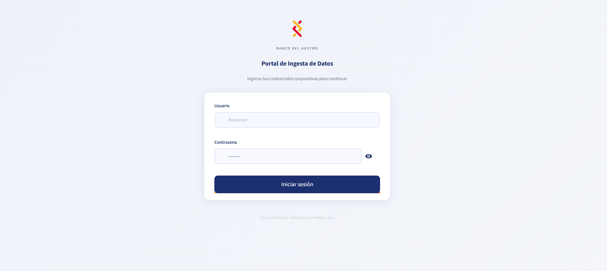

## Seleccion de proyecto y catalogo

Una vez dentro del portal, el usuario selecciona el proyecto y el catalogo que
tiene habilitado para cargar.

Tanto el `Publicador` como el `Admin` pueden usar el flujo de carga, siempre
que tengan permisos sobre el proyecto y el catalogo correspondiente.

Desde el panel lateral, el sistema permite:

- escoger el proyecto permitido;
- escoger el catalogo permitido;
- revisar la tabla fisica asociada;
- ver la estrategia configurada;
- ver el destino configurado;
- consultar las columnas esperadas del archivo antes de cargarlo.

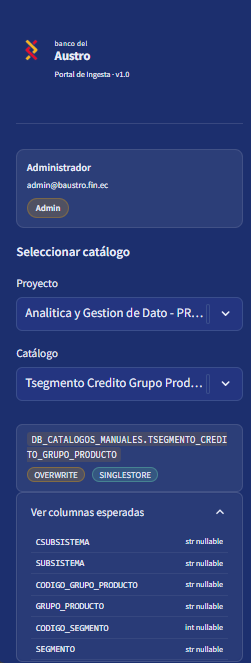`

## Que puede hacer el usuario

Con Data Gatekeeper, un usuario puede:

- iniciar sesion con sus credenciales;
- seleccionar el proyecto y catalogo que tiene habilitado;
- subir uno o varios archivos permitidos;
- revisar una previsualizacion antes de continuar;
- validar el contenido antes de cargarlo;
- ver los errores encontrados si el archivo no cumple las reglas;
- descargar un reporte de errores;
- confirmar la carga si todo esta correcto;
- consultar su historial de cargas.

## Perfiles del sistema

Dentro del portal existen dos perfiles principales:

- `Publicador`: usuario que carga archivos.
- `Admin`: usuario que configura y controla el portal.

## Que hace el publicador

El publicador es la persona responsable de subir el archivo correcto y revisar
si cumple las reglas del catalogo antes de cargarlo.

En la practica, el publicador puede:

- ingresar al portal con sus credenciales;
- ver solo los proyectos y catalogos para los que tiene permiso;
- seleccionar el catalogo que desea cargar;
- revisar informacion basica del catalogo;
- subir uno o varios archivos permitidos;
- ajustar opciones de lectura si el archivo no se visualiza bien;
- revisar una previsualizacion antes de validar;
- ejecutar la validacion del archivo;
- revisar los errores encontrados por fila, columna y motivo;
- descargar un reporte de errores;
- confirmar la carga cuando la validacion sea exitosa;
- consultar su historial de cargas;
- volver a intentar una carga despues de corregir un archivo.

### Carga de archivos

El publicador puede subir archivos permitidos y revisar si fueron leidos
correctamente antes de continuar.

En este paso, el sistema permite:

- seleccionar uno o varios archivos;
- detectar el separador de lectura;
- ajustar la lectura si las columnas no se visualizan bien;
- mostrar una previsualizacion del contenido;
- indicar cantidad de filas, columnas y archivos cargados.

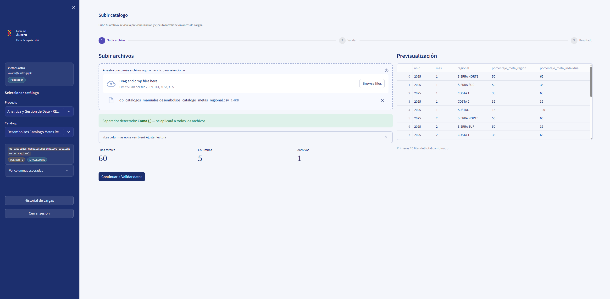`

### Previsualizacion del archivo

Antes de validar, el usuario puede revisar una muestra del contenido para
confirmar que columnas y datos se ven correctamente.

La previsualizacion sirve para confirmar:

- que el archivo fue interpretado correctamente;
- que las columnas visibles coinciden con lo esperado;
- que el orden y el contenido se ven bien antes de pasar a validacion.

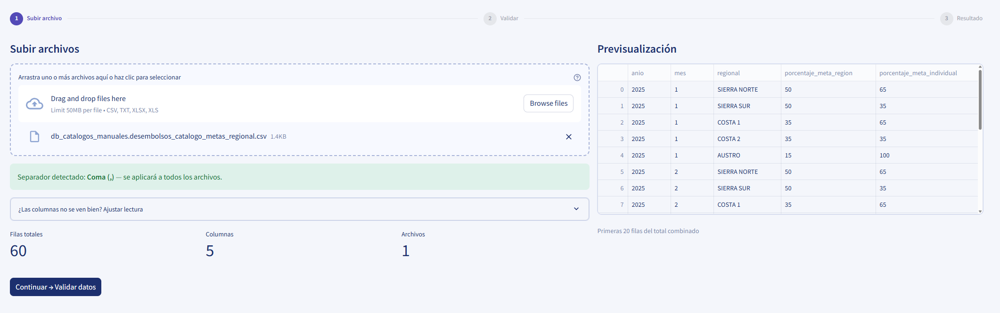`

### Validacion con errores

Si el archivo no cumple las reglas, el sistema muestra el detalle de los
errores para que el usuario los corrija.

En el paso `Validar`, el sistema revisa estructura y contenido. Si encuentra
problemas:

- marca la validacion como fallida;
- muestra cuantos errores fueron encontrados;
- presenta una consola o tabla de errores;
- indica fila, columna, valor, regla y detalle del problema;
- permite descargar un reporte de errores para corregir el archivo en origen.

Mientras existan errores, la carga no se ejecuta.

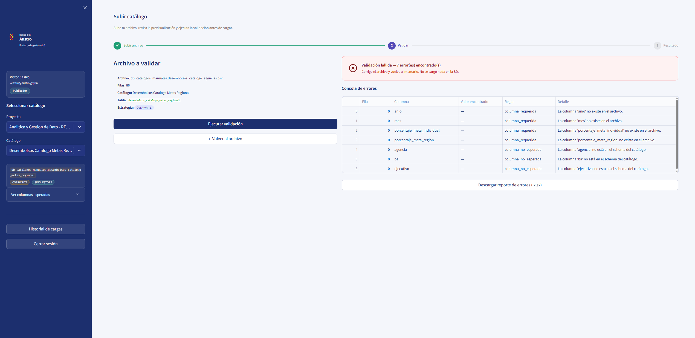`

### Validacion exitosa

Si el archivo cumple correctamente la estructura y las reglas del catalogo, el
sistema muestra una validacion exitosa antes de ejecutar la carga final.

En esta vista el usuario puede revisar:

- el sistema muestra el resumen de filas validadas;
- informa que no existen errores;
- habilita la confirmacion de carga;
- permite continuar al paso final de carga.

Esto significa que el archivo ya paso todas las validaciones previas y que el
usuario puede continuar con confianza al paso de carga.

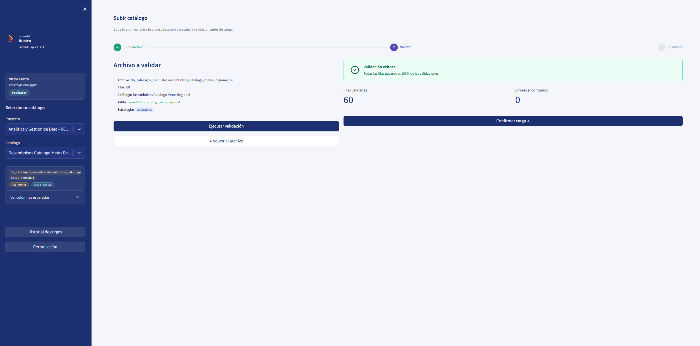

### Carga exitosa

Si todo esta correcto, el sistema permite confirmar la carga y muestra el
resultado final.

Cuando la carga se ejecuta exitosamente:

- registra la operacion;
- muestra el resultado final con auditoria, usuario, fecha, archivo, estado y
  ruta auditada.

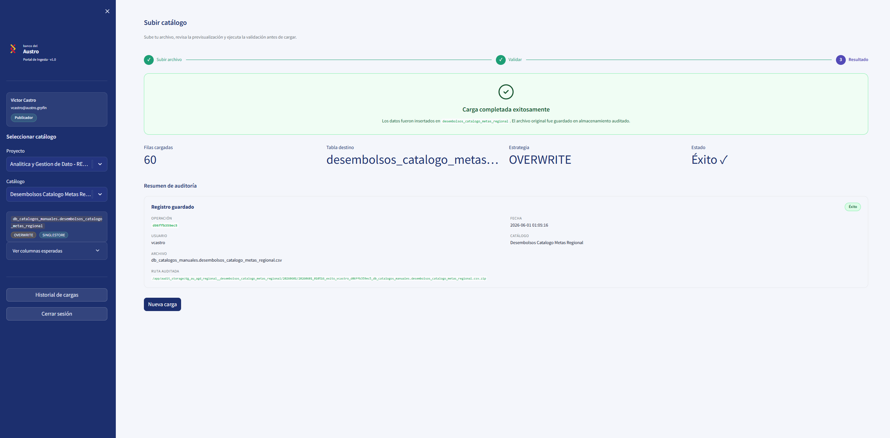

## Que no hace el publicador

El publicador no administra el sistema ni cambia la configuracion interna del
catalogo.

Por eso, normalmente no puede:

- crear nuevos catalogos;
- cambiar reglas de validacion;
- cambiar permisos de otros usuarios;
- modificar usuarios o roles;
- cargar catalogos que no tiene habilitados;
- forzar una carga con errores;
- omitir la validacion previa.

## Que hace el admin

El admin es la persona encargada de preparar el portal para que los
publicadores puedan trabajar de forma controlada.

En la practica, el admin puede:

- ingresar al panel de administracion;
- revisar un resumen general de actividad;
- ver catalogos activos;
- registrar nuevos catalogos;
- asociar catalogos a proyectos;
- definir el nombre visible del catalogo;
- indicar la tabla destino;
- definir la estrategia de carga;
- configurar la estructura esperada del archivo;
- definir tipos de dato por columna;
- marcar si una columna permite o no valores vacios;
- configurar reglas de validacion;
- asignar permisos por rol o por usuario;
- activar o desactivar catalogos;
- editar configuraciones existentes;
- revisar el historial de cargas;
- administrar usuarios del portal;
- cambiar roles de usuarios;
- activar o desactivar usuarios segun necesidad.

### Panel de administracion

Desde esta vista el admin puede acceder a varias secciones del sistema para
gestionar la operacion completa del portal.

Normalmente, en el menu principal el admin puede entrar a opciones como:

- cargar archivos;
- administrar catalogos;
- historial de cargas;
- administracion de usuarios.

Esto significa que el admin no solo configura catalogos, sino que tambien
puede revisar lo que ya fue cargado y, si tiene permisos, usar el mismo flujo
de carga que utiliza un publicador.

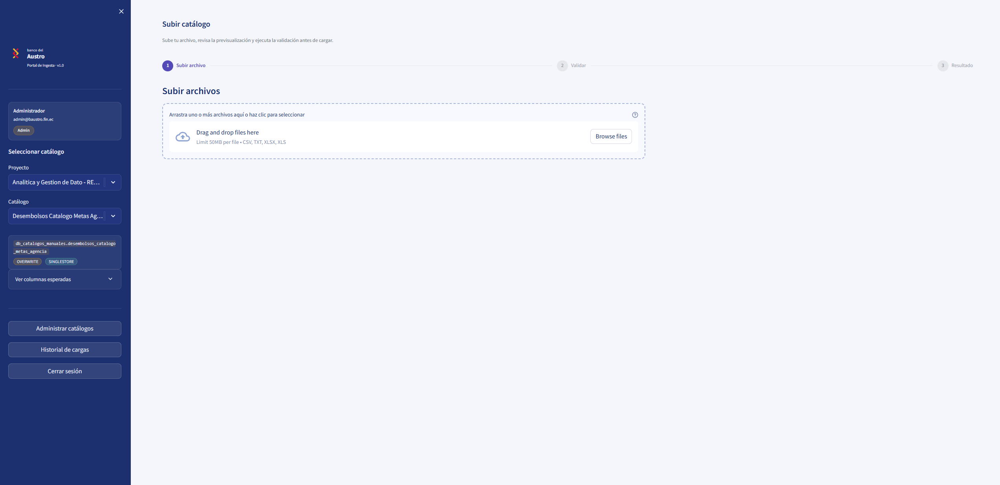

### Secciones dentro de administrar catalogos

Cuando el admin entra a la opcion de administrar catalogos, el sistema muestra
varias pestañas o secciones para trabajar sobre la configuracion del portal.

Entre las vistas mas importantes estan:

- `Resumen`: muestra informacion general del estado del portal, catalogos
  disponibles y actividad reciente.
- `Registrar catalogo`: permite crear un catalogo nuevo, asociarlo a un
  proyecto, indicar tabla destino, estrategia y reglas de validacion.
- `Catalogos activos`: permite revisar catalogos ya configurados, editar su
  estructura, cambiar permisos o desactivarlos si ya no deben usarse.
- `Usuarios`: permite revisar usuarios del portal, cambiar roles y activar o
  desactivar accesos.

Estas secciones ayudan a que el admin pueda controlar el ciclo completo de
configuracion, mantenimiento y seguimiento de catalogos.

### Registrar catalogo - Paso 1: seleccion de tablas

En la seccion `Registrar catalogos`, el admin primero usa un explorador para
seleccionar desde que base de datos quiere trabajar y que tablas desea
registrar.

En esta pantalla el sistema permite:

- cargar las bases de datos disponibles;
- listar las tablas disponibles dentro de la base seleccionada;
- refrescar el listado de tablas;
- buscar una tabla por nombre;
- marcar una o varias tablas para registro;
- ver si una tabla esta disponible o si ya fue registrada;
- revisar una tabla activa antes de continuar.

Cuando se selecciona una tabla, el sistema muestra su estructura esperada y
permite revisar:

- las columnas detectadas;
- el tipo de dato de cada columna;
- si una columna acepta o no valores nulos;
- reglas de calidad por columna.

Las reglas que se pueden agregar dependen del tipo de dato de la columna. Por
ejemplo, una columna numerica puede tener limites minimos o maximos, mientras
que una columna de texto puede usar longitud, dominio o patrones de validacion.

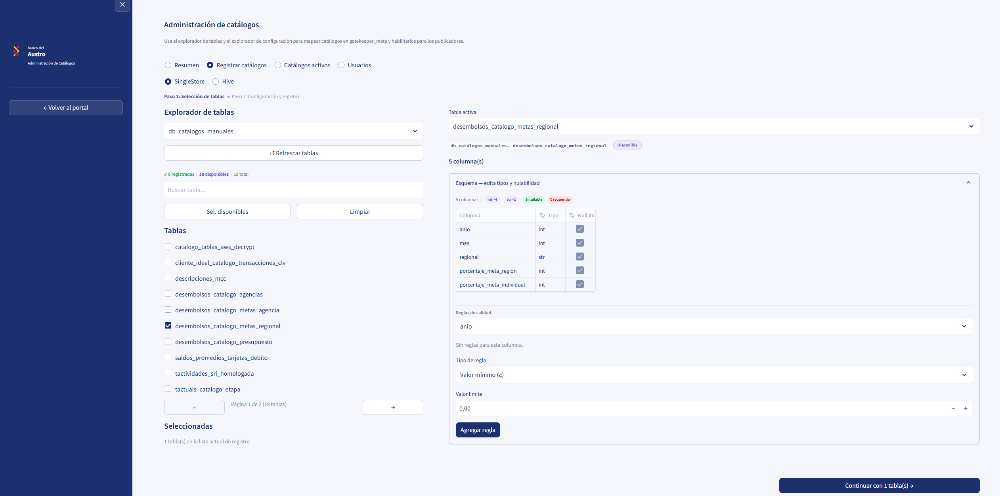`

### Registrar catalogo - Paso 2: configuracion y registro de una tabla

Cuando el admin continua con una sola tabla, el sistema muestra un formulario
de configuracion del catalogo.

En esta pantalla se definen datos como:

- `Proyecto`: grupo funcional al que pertenecera la tabla;
- `ID del proyecto`: identificador tecnico del grupo;
- `Nombre del proyecto`: nombre visible del grupo;
- `ID del catalogo`: identificador tecnico unico del catalogo;
- `Nombre legible`: nombre visible con el que el usuario vera el catalogo;
- `Descripcion`: texto opcional para explicar el uso del catalogo;
- `Estrategia`: forma de carga, por ejemplo `overwrite` o `append`;
- `Destino`: sistema al que se escribira la carga, por ejemplo
  `singlestore`;
- `Roles`: perfiles autorizados para usar ese catalogo;
- `Usuarios especificos`: usuarios concretos con permiso adicional.

Si no se selecciona ningun rol ni ningun usuario especifico, el catalogo queda
accesible para todos los publicadores habilitados.

El campo `Nombre legible` sirve para mostrar un nombre claro en pantalla,
mientras que el `ID del catalogo` y el `ID del proyecto` sirven como
identificadores tecnicos internos.

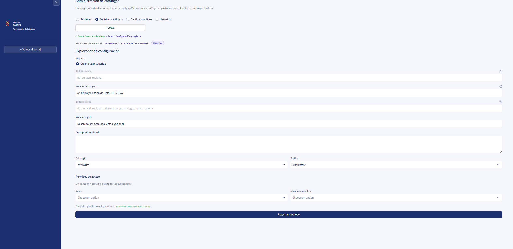`

### Registro masivo de varias tablas

Si el admin selecciona mas de una tabla, el sistema cambia a un flujo de
registro por lote.

En este caso:

- cada tabla mantiene su propio nombre legible;
- cada tabla conserva su identidad individual dentro del sistema;
- todas las tablas seleccionadas se pueden registrar dentro de un mismo
  proyecto;
- el proyecto sirve para agrupar tablas relacionadas, por ejemplo tablas de
  `Comex`, `SRI`, `Regional` o cualquier otra unidad funcional.

Esto permite que varias tablas queden asociadas a un mismo contexto de negocio,
sin perder su configuracion propia.

En el registro masivo, el admin puede:

- revisar la lista de tablas seleccionadas;
- ajustar datos particulares de una tabla activa;
- definir configuracion comun para todo el lote;
- indicar proyecto, estrategia y destino compartidos;
- asignar roles o usuarios permitidos para todas las tablas del lote;
- registrar varias tablas en una sola operacion.

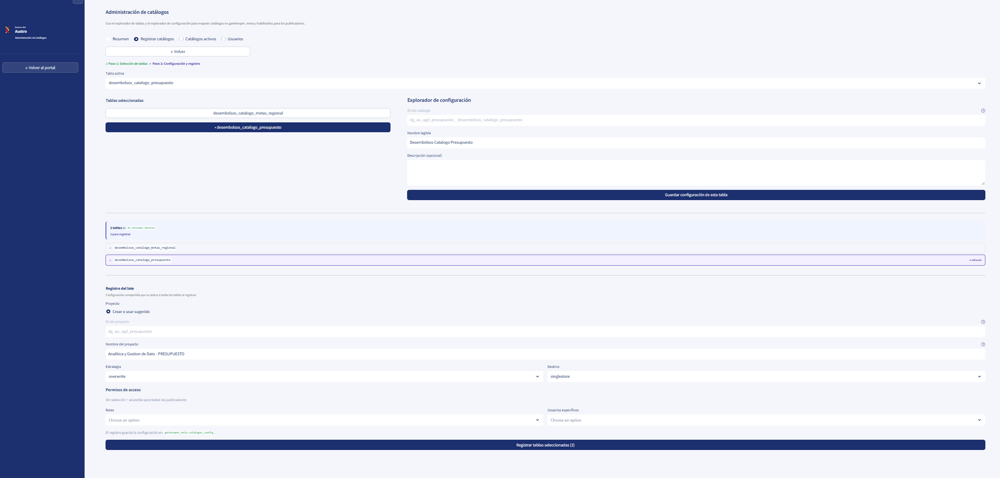`

### Catalogos activos

La seccion `Catalogos activos` permite revisar todo lo que ya fue registrado en
el sistema y administrarlo por proyecto.

En esta vista el admin puede:

- buscar catalogos por nombre, base de datos o tabla;
- ver cuantos catalogos activos existen;
- abrir cada proyecto como si fuera una carpeta logica;
- revisar las tablas o catalogos asociados a ese proyecto;
- identificar el nombre legible del catalogo;
- ver la tabla fisica asociada;
- revisar la estrategia configurada;
- revisar el destino configurado;
- ver que roles o usuarios tienen acceso;
- editar la configuracion de un catalogo;
- administrar permisos de acceso;
- desactivar catalogos que ya no deban usarse.

La agrupacion por proyecto ayuda a entender el contexto funcional de cada
tabla. Por ejemplo, un proyecto puede representar un grupo de tablas de
`Regional`, `Comex`, `SRI` o cualquier otra unidad de negocio. Al abrir ese
proyecto, se muestran los catalogos que pertenecen a ese mismo grupo.

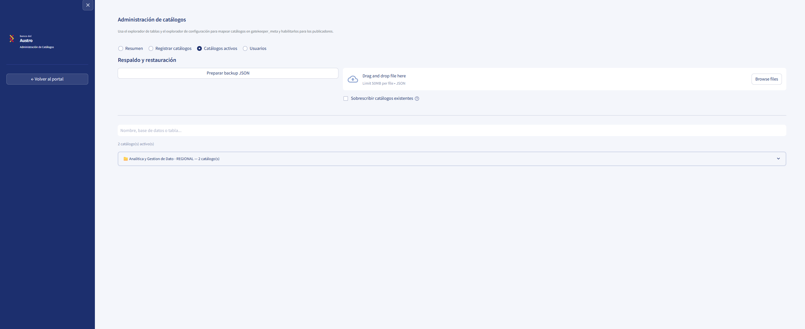`

### Respaldo y restauracion de configuraciones

Dentro de `Catalogos activos`, el sistema tambien permite preparar un respaldo
de configuraciones y restaurarlo despues.

Desde esta vista el admin puede:

- descargar un backup en formato JSON;
- subir nuevamente una configuracion guardada;
- restaurar catalogos previamente exportados;
- decidir si quiere o no sobrescribir catalogos existentes durante la
  importacion.

Esto sirve para mover configuraciones entre ambientes, guardar una copia de
seguridad o recuperar catalogos ya definidos sin tener que registrarlos otra
vez manualmente.

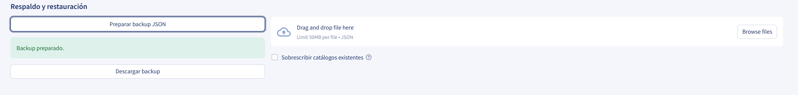`

### Editar un catalogo activo

Cuando el admin selecciona la opcion `Editar` sobre un catalogo activo, el
sistema abre un formulario para actualizar su configuracion.

En esta vista se puede modificar:

- el nombre visible del catalogo;
- la descripcion;
- la estrategia de carga;
- el destino;
- la estructura de columnas;
- el tipo de dato de cada columna;
- si una columna acepta o no valores nulos;
- las reglas de calidad por columna.

Esto permite mantener vigente la configuracion del catalogo cuando cambia la
estructura esperada del archivo o cuando se deben ajustar reglas de negocio.

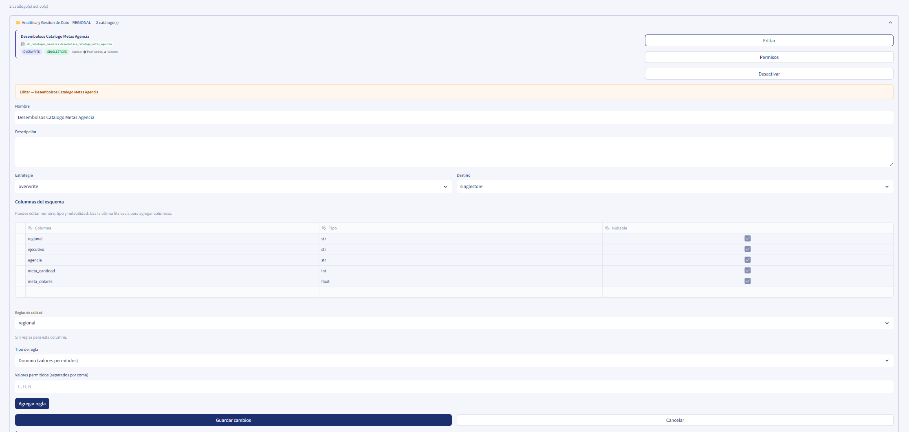`

### Permisos de un catalogo activo

Cuando el admin entra a la opcion `Permisos`, el sistema permite controlar con
mas precision quien puede usar ese catalogo.

En esta pantalla se pueden definir:

- roles autorizados, por ejemplo `Admin` o `Publicador`;
- usuarios especificos con acceso directo;
- combinaciones de roles y usuarios segun la necesidad del catalogo.

Si no se selecciona ningun rol ni ningun usuario especifico, el catalogo queda
disponible para todos los publicadores habilitados.

Esto sirve para restringir catalogos sensibles o habilitar accesos especiales
sin cambiar el comportamiento general del portal.

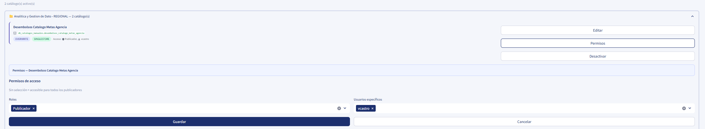`

### Usuarios

La seccion `Usuarios` permite administrar las personas que ya ingresaron al
portal y quedaron registradas dentro del sistema.

En esta vista el admin puede:

- ver cuantos usuarios existen por rol, por ejemplo `Admins` y
  `Publicadores`;
- revisar nombre, usuario, correo y ultimo acceso;
- identificar si una cuenta esta activa o desactivada;
- cambiar el rol de un usuario dentro del portal;
- activar o desactivar el acceso de un usuario al sistema.

Esto sirve para mantener control operativo sobre quienes pueden usar el portal
sin necesidad de volver a registrar usuarios manualmente.

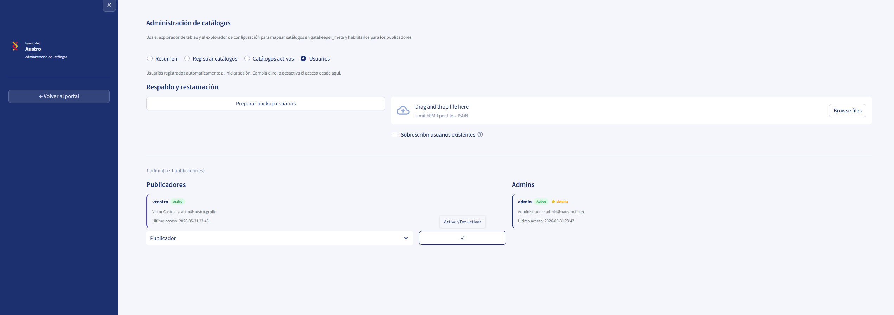`

### Respaldo y restauracion de usuarios

Dentro de la seccion `Usuarios`, el sistema tambien permite preparar y
restaurar respaldos de usuarios.

Desde esta pantalla el admin puede:

- descargar un backup de usuarios en formato JSON;
- subir un archivo de usuarios previamente exportado;
- restaurar usuarios guardados;
- decidir si desea sobrescribir usuarios existentes durante la importacion.

Esto ayuda a mover configuraciones entre ambientes, recuperar listas de
usuarios administrados y mantener una copia de seguridad de la configuracion
del acceso al portal.

`

### Cambio de rol y desactivacion de usuarios

En la misma vista de `Usuarios`, el admin puede realizar acciones directas
sobre cada cuenta registrada.

Entre las acciones principales estan:

- cambiar un usuario de `Publicador` a `Admin`, o viceversa;
- guardar el nuevo rol dentro del sistema;
- activar una cuenta si el usuario debe volver a usar el portal;
- desactivar una cuenta para impedir que siga ingresando.

Cuando un usuario es desactivado, deja de poder entrar al sistema, pero su
historial y sus registros previos se mantienen para fines de trazabilidad y
auditoria.

## Que no hace el admin desde el portal

Aunque el admin tiene mas permisos, el portal no reemplaza tareas de
infraestructura ni de desarrollo.

Por eso, el admin normalmente no hace desde aqui:

- cambios tecnicos del servidor;
- cambios directos en la base de datos fuera del flujo del portal;
- correcciones automáticas del contenido de un archivo;
- desarrollo de nuevas funcionalidades;
- administracion del sistema operativo o de la red.

## Que revisa el sistema antes de cargar

Antes de aceptar una carga, el sistema puede revisar cosas como estas:

- que el archivo tenga las columnas correctas;
- que no falten columnas obligatorias;
- que no existan columnas adicionales;
- que el archivo no este vacio;
- que los datos tengan el formato esperado;
- que los campos obligatorios no vengan vacios;
- que ciertos valores esten dentro de lo permitido;
- que algunos textos o numeros cumplan reglas definidas para ese catalogo.

Si alguna de estas validaciones falla, no se carga nada.

## Que pasa si el archivo tiene errores

Si el archivo no cumple las reglas:

- la carga se rechaza;
- el sistema muestra el detalle del problema;
- el usuario debe corregir el archivo en origen;
- luego puede volver a intentarlo.

El sistema no corrige los datos automaticamente ni completa informacion faltante.

## Que si puede hacer el sistema

- validar el archivo antes de la carga;
- proteger la tabla destino de archivos incorrectos;
- mostrar errores de forma clara;
- registrar quien hizo la carga y cuando;
- guardar evidencia auditada del archivo cargado;
- permitir trazabilidad de cargas exitosas o fallidas.

## Que no hace el sistema

- no corrige errores del archivo por el usuario;
- no modifica reglas de negocio desde la pantalla del publicador;
- no permite cargar catalogos para los que no tengas permiso;
- no garantiza la carga si el archivo tiene errores;
- no reemplaza la responsabilidad del usuario sobre el contenido del archivo.

## Que esperar del proceso de carga

Cuando un usuario sube un archivo, el sistema sigue una logica simple:

1. recibe el archivo;
2. revisa si el formato puede leerse;
3. muestra una previsualizacion;
4. valida estructura y contenido;
5. si hay errores, detiene el proceso y permite descargar el reporte;
6. si todo esta correcto, permite confirmar la carga;
7. registra el resultado para auditoria e historial;
8. muestra el resultado final como exito o fallo.

Esto significa que una carga exitosa depende tanto del archivo como de los
permisos y la configuracion del catalogo.

## Historial de cargas

El sistema permite consultar el historial de cargas para revisar intentos
exitosos o fallidos.

En esta vista se puede revisar informacion como:

- quien realizo la carga;
- cuando se ejecuto;
- a que proyecto y catalogo correspondio;
- si la carga fue exitosa o fallida;
- cuantos registros fueron procesados;
- que archivo se utilizo.

El comportamiento cambia segun el perfil:

- para un `Publicador`, el historial muestra solo sus propias cargas;
- para un `Admin`, el historial muestra las cargas de todos los usuarios.

Para un admin, esta vista ayuda a dar seguimiento operativo, comparar actividad
entre usuarios y revisar trazabilidad global. Para un publicador, sirve para
consultar sus intentos previos y entender el resultado de cada carga.

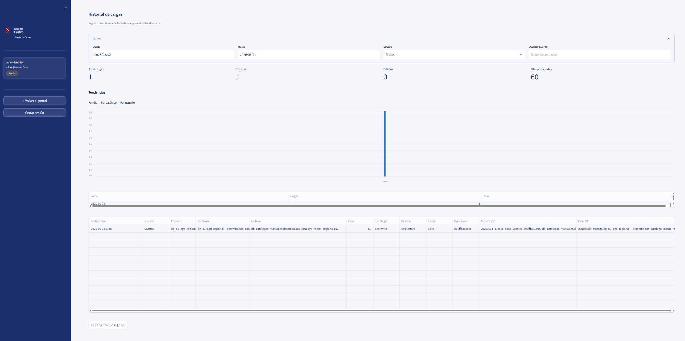

## Como usarlo de forma simple

1. Ingresa al portal.
2. Elige el proyecto y el catalogo.
3. Sube tu archivo.
4. Revisa la previsualizacion.
5. Ejecuta la validacion.
6. Corrige el archivo si el sistema reporta errores.
7. Confirma la carga solo cuando la validacion sea exitosa.

## Que gana el usuario con este portal

El usuario mantiene el control de su archivo, pero dentro de un proceso mas
seguro y ordenado.

Esto ayuda a:

- reducir errores en tablas finales;
- evitar retrabajos posteriores;
- tener mas claridad sobre por que una carga falla;
- contar con un historial de lo que ya fue cargado;
- trabajar con un proceso estandar y auditable.

## Recomendacion para las imagenes

Para que el README se vea ordenado, procura que las capturas:

- tengan nombres simples;
- muestren solo la parte importante;
- no expongan datos sensibles;
- mantengan un orden parecido al flujo real del usuario.

Un orden recomendado para las imagenes del README puede ser este:

1. login;
2. seleccion de proyecto y catalogo;
3. carga de archivos;
4. previsualizacion;
5. errores de validacion;
6. carga exitosa;
7. historial de cargas;
8. panel admin;
9. resumen admin;
10. registrar catalogo;
11. catalogos activos;
12. usuarios admin.
