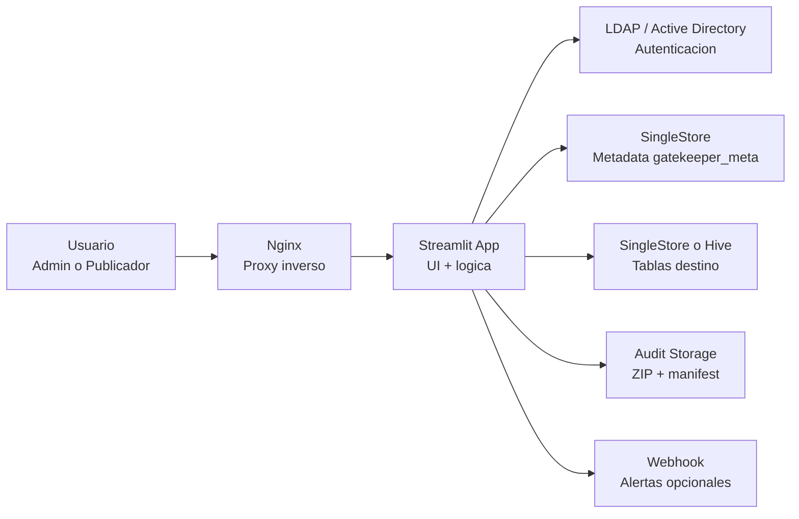
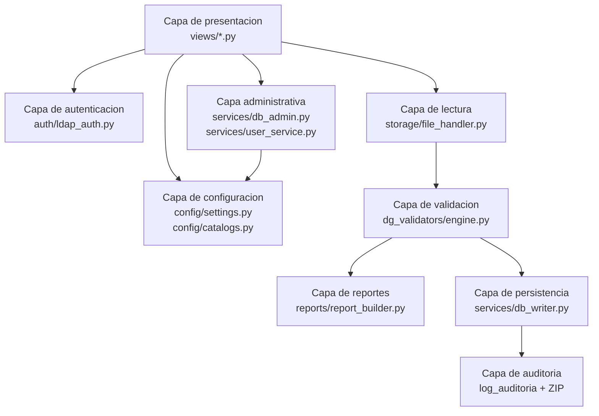
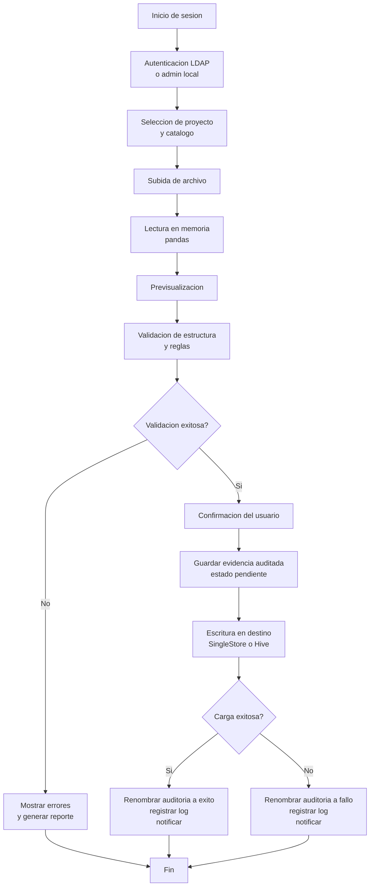
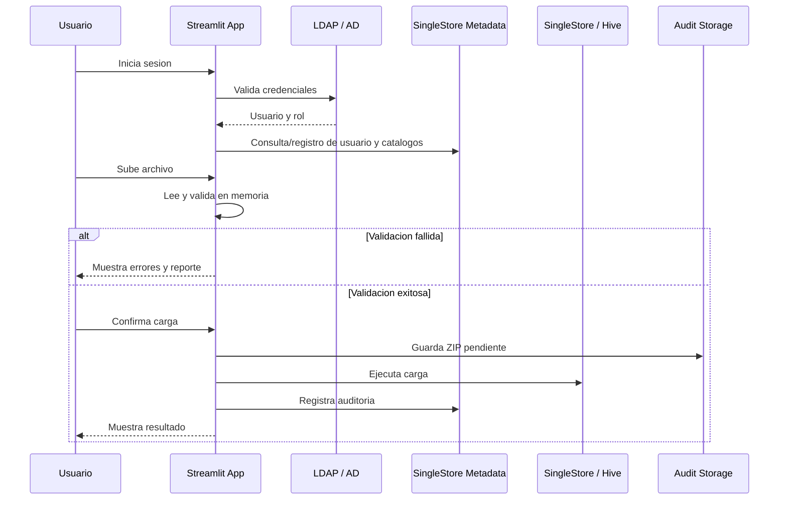

# Data Gatekeeper

## Documento Tecnico del Sistema

Este documento describe la arquitectura tecnica actual de Data Gatekeeper,
sus componentes principales, el flujo interno de la aplicacion, la estructura
del codigo y los criterios funcionales que gobiernan la carga y validacion de
catalogos.

## 1. Proposito del sistema

Data Gatekeeper es una aplicacion interna orientada a controlar la ingesta de
catalogos manuales hacia bases de datos corporativas.

El sistema busca resolver estos problemas:

- cargas manuales realizadas por canales no controlados;
- archivos con estructura variable;
- errores de formato detectados demasiado tarde;
- falta de trazabilidad sobre quien cargo que archivo y con que resultado;
- dependencia de soporte tecnico para operaciones repetitivas de carga.

La aplicacion introduce un punto unico de entrada donde el archivo es leido,
previsualizado, validado en memoria y, solo si cumple las reglas definidas para
su catalogo, cargado al destino final.

## 2. Vision general de arquitectura

La solucion esta construida principalmente sobre `Streamlit`, con una
arquitectura unificada de interfaz y backend ligero en Python.

Los bloques funcionales son:

- interfaz web en `Streamlit`;
- autenticacion corporativa por `LDAP / Active Directory`;
- lectura y preprocesamiento de archivos con `pandas`;
- validacion declarativa por esquema JSON mediante un motor propio;
- escritura a `SingleStore` o `Hive`;
- auditoria de cargas en metadata de `SingleStore`;
- almacenamiento auditado del archivo original en ZIP;
- despliegue soportado con `Docker` y `Nginx`.

### 2.1 Diagrama general de arquitectura

### 2.2 Diagrama logico por capas

## 3. Componentes principales

### 3.1 Capa de presentacion

La presentacion esta implementada en `Streamlit`.

Funciones principales:

- login del usuario;
- seleccion de proyecto y catalogo;
- carga de archivo;
- previsualizacion del contenido;
- ejecucion de validaciones;
- visualizacion de errores;
- confirmacion de carga;
- historial de operaciones;
- administracion de catalogos y usuarios.

Punto de entrada:

- [app.py](/d:/USERS/ue01006628/Documents/Data%20Gatekeeper/data_gatekeeper/app.py)

Vistas principales:

- [views/login_view.py](/d:/USERS/ue01006628/Documents/Data%20Gatekeeper/data_gatekeeper/views/login_view.py)
- [views/main_view.py](/d:/USERS/ue01006628/Documents/Data%20Gatekeeper/data_gatekeeper/views/main_view.py)
- [views/history_view.py](/d:/USERS/ue01006628/Documents/Data%20Gatekeeper/data_gatekeeper/views/history_view.py)
- [views/admin_catalogs_view.py](/d:/USERS/ue01006628/Documents/Data%20Gatekeeper/data_gatekeeper/views/admin_catalogs_view.py)

### 3.2 Capa de autenticacion

La autenticacion se implementa con el binario del sistema `ldapsearch`.

Adicionalmente existe un administrador local de contingencia definido por
configuracion.

Archivo principal:

- [auth/ldap_auth.py](/d:/USERS/ue01006628/Documents/Data%20Gatekeeper/data_gatekeeper/auth/ldap_auth.py)

Capacidades:

- validacion de credenciales;
- lectura de atributos de usuario;
- resolucion de rol por grupos;
- restriccion opcional por grupo requerido;
- soporte para admin local.

### 3.3 Capa de configuracion

La configuracion se centraliza en variables de entorno cargadas por
`python-dotenv`.

Archivo principal:

- [config/settings.py](/d:/USERS/ue01006628/Documents/Data%20Gatekeeper/data_gatekeeper/config/settings.py)

La resolucion de proyectos y catalogos se realiza desde metadata persistida en
SingleStore.

Archivo principal:

- [config/catalogs.py](/d:/USERS/ue01006628/Documents/Data%20Gatekeeper/data_gatekeeper/config/catalogs.py)

Funciones relevantes:

- listar proyectos activos;
- listar catalogos de un proyecto;
- filtrar catalogos por permisos;
- obtener configuracion individual de un catalogo.

### 3.4 Capa de lectura de archivos

La lectura del archivo se realiza en memoria usando `pandas`.

Archivo principal:

- [storage/file_handler.py](/d:/USERS/ue01006628/Documents/Data%20Gatekeeper/data_gatekeeper/storage/file_handler.py)

Formatos soportados:

- `csv`
- `txt`
- `xlsx`
- `xls`

Capacidades:

- lectura de archivos binarios desde la UI;
- deteccion de delimitador;
- soporte para ajuste manual de codificacion;
- lectura de hojas Excel;
- devolucion de errores amigables de lectura;
- estadisticas basicas del archivo para mostrar en la interfaz.

### 3.5 Capa de validacion

La validacion no usa `pandera` actualmente. El sistema implementa un motor
propio basado en definiciones JSON por catalogo.

Archivo principal:

- [dg_validators/engine.py](/d:/USERS/ue01006628/Documents/Data%20Gatekeeper/data_gatekeeper/dg_validators/engine.py)

El esquema esperado se almacena en `catalogos_config.schema_json` y se compone
principalmente por una lista de columnas con:

- nombre;
- tipo;
- nullable;
- reglas.

Tipos soportados:

- `str`
- `int`
- `float`
- `bool`

Reglas soportadas:

- `isin`
- `gte`
- `lte`
- `min_length`
- `str_length`
- `regex`

Validaciones estructurales:

- columnas exactas esperadas;
- columnas faltantes;
- columnas adicionales;
- archivo no vacio.

Validaciones por contenido:

- casteo seguro de tipos;
- nulabilidad;
- dominio;
- limites minimos y maximos;
- longitud de texto;
- expresion regular.

Salida del motor:

- `ValidationResult`
- lista de `ValidationError`
- conversion a `DataFrame` para mostrar errores en UI

### 3.6 Capa de reporte de errores

Cuando la validacion falla, el sistema puede construir un archivo Excel con el
detalle de errores encontrados.

Archivo principal:

- [reports/report_builder.py](/d:/USERS/ue01006628/Documents/Data%20Gatekeeper/data_gatekeeper/reports/report_builder.py)

El reporte incluye:

- hoja de resumen;
- metadatos de la carga;
- conteo por tipo de error;
- hoja de detalle;
- coloreado visual por categoria de problema.

### 3.7 Capa de persistencia y carga

La escritura a bases de datos esta encapsulada en servicios.

Archivo principal:

- [services/db_writer.py](/d:/USERS/ue01006628/Documents/Data%20Gatekeeper/data_gatekeeper/services/db_writer.py)

Destinos soportados:

- `SingleStore`
- `Hive`

Estrategias soportadas:

- `append`
- `overwrite`
- `reproceso`

#### SingleStore

La carga a `SingleStore` usa SQL parametrizado y operaciones por lotes.

Comportamiento por estrategia:

- `append`: insercion incremental;
- `overwrite`: `TRUNCATE` seguido de `INSERT` dentro de bloque transaccional;
- `reproceso`: borrado por fechas detectadas en el archivo e insercion posterior
  dentro de bloque transaccional.

#### Hive

La carga a `Hive` usa `pyhive` y sentencias `INSERT`.

Comportamiento por estrategia:

- `append`: `INSERT INTO`;
- `overwrite`: `INSERT OVERWRITE`;
- `reproceso`: `INSERT OVERWRITE` por particion o por valor de fecha.

Observacion importante:

`Hive` no se maneja con la misma semantica transaccional que `SingleStore`.
En el estado actual del proyecto, la consistencia en Hive depende del patron de
insercion y del manejo de particiones, no de `BEGIN/COMMIT` como en
SingleStore.

### 3.8 Capa de auditoria

La auditoria tiene dos dimensiones:

- metadata de la operacion en `SingleStore`;
- almacenamiento del archivo original comprimido en disco.

La metadata se guarda en `log_auditoria`.

La evidencia fisica se guarda como ZIP en la ruta de auditoria configurada.

Capacidades:

- generacion de `operation_id`;
- almacenamiento del archivo original;
- generacion de `audit_manifest.json`;
- renombrado del ZIP segun estado final;
- endurecimiento de permisos del archivo auditado;
- consulta del historial de cargas.

### 3.9 Capa administrativa

La administracion funcional del sistema se implementa en:

- [services/db_admin.py](/d:/USERS/ue01006628/Documents/Data%20Gatekeeper/data_gatekeeper/services/db_admin.py)
- [services/user_service.py](/d:/USERS/ue01006628/Documents/Data%20Gatekeeper/data_gatekeeper/services/user_service.py)

Capacidades administrativas:

- descubrimiento de bases y tablas en SingleStore;
- descubrimiento de bases y tablas en Hive;
- construccion inicial de esquema JSON desde una tabla;
- creacion de proyectos;
- registro y edicion de catalogos;
- activacion y desactivacion de catalogos;
- gestion de permisos;
- gestion de usuarios;
- exportacion e importacion de backups funcionales de catalogos y usuarios.

### 3.10 Notificaciones

El sistema incluye un notificador por webhook HTTP.

Archivo principal:

- [services/notifier.py](/d:/USERS/ue01006628/Documents/Data%20Gatekeeper/data_gatekeeper/services/notifier.py)

Eventos soportados:

- carga exitosa;
- carga fallida.

Las alertas pueden habilitarse o deshabilitarse por configuracion.

## 4. Flujo tecnico de extremo a extremo

### 4.1 Diagrama del flujo de carga

### 4.2 Secuencia resumida

El flujo tecnico principal es el siguiente:

1. El usuario inicia sesion.
2. El sistema autentica contra LDAP o admin local.
3. Se recupera o registra el usuario en metadata.
4. El usuario selecciona proyecto y catalogo.
5. El sistema consulta metadata del catalogo y permisos.
6. El usuario sube uno o varios archivos.
7. El archivo se lee en memoria con `pandas`.
8. Se detecta delimitador, hoja o codificacion si aplica.
9. Se muestra una previsualizacion.
10. Se ejecuta la validacion sobre el `DataFrame`.
11. Si falla la validacion, no se escribe nada y se devuelve el detalle.
12. Si la validacion es exitosa, el usuario confirma la carga.
13. Se almacena primero la evidencia auditada en estado `pendiente`.
14. Se ejecuta la estrategia de escritura en el destino configurado.
15. Si la carga finaliza bien, la auditoria pasa a estado `exito`.
16. Si la carga falla, la auditoria pasa a estado `fallo`.
17. Se registra la operacion en `log_auditoria`.
18. Opcionalmente se emite una notificacion webhook.

## 5. Modelo de datos administrativo

La base administrativa esperada es `gatekeeper_meta`.

Tablas principales:

- `proyectos`
- `catalogos_config`
- `usuarios`
- `permisos_catalogo`
- `log_auditoria`

Definicion base:

- [docker/init_db/01_init.sql](/d:/USERS/ue01006628/Documents/Data%20Gatekeeper/data_gatekeeper/docker/init_db/01_init.sql)

### 5.1 proyectos

Agrupa catalogos por unidad logica.

Campos principales:

- `project_id`
- `nombre`
- `descripcion`
- `activo`

### 5.2 catalogos_config

Tabla central de configuracion.

Campos principales:

- `catalog_id`
- `project_id`
- `nombre`
- `descripcion`
- `base_datos`
- `tabla_destino`
- `destino`
- `estrategia`
- `schema_json`
- `activo`

### 5.3 usuarios

Tabla interna de usuarios del portal.

Campos principales:

- `username`
- `nombre`
- `email`
- `rol`
- `activo`
- `ultimo_acceso`

### 5.4 permisos_catalogo

Restringe acceso a catalogos.

Campos principales:

- `catalog_id`
- `tipo`
- `valor`

### 5.5 log_auditoria

Registro de intentos de carga.

Campos principales:

- `id`
- `operation_id`
- `timestamp_carga`
- `usuario_ad`
- `project_id`
- `id_catalogo`
- `nombre_archivo_original`
- `filas_procesadas`
- `estrategia_usada`
- `destino`
- `estado_carga`
- `errores_json`
- `ruta_zip_auditoria`

## 6. Gestion de roles

El sistema maneja dos perfiles funcionales:

- `Admin`
- `Publicador`

Resolucion del rol:

- por grupo LDAP en autenticacion;
- por admin local de contingencia;
- por persistencia posterior en tabla `usuarios`.

Comportamiento esperado:

- `Admin` accede a vistas administrativas, usuarios y catalogos;
- `Publicador` accede a carga e historial propio;
- los permisos de catalogo limitan lo visible y operable.

## 7. Estructura del proyecto

Resumen de carpetas principales:

- `assets/`: imagenes del portal y recursos visuales;
- `auth/`: autenticacion;
- `config/`: settings y proveedor de catalogos;
- `dg_validators/`: motor de validacion;
- `docker/`: despliegue y scripts auxiliares;
- `reports/`: reportes de errores;
- `scripts/`: healthchecks y utilitarios;
- `services/`: reglas de integracion con BD, auditoria, usuarios y admin;
- `storage/`: lectura de archivos;
- `tests/`: pruebas automatizadas;
- `utils/`: logging y mensajes de error;
- `views/`: pantallas Streamlit.

## 8. Configuracion operativa

La aplicacion usa variables de entorno para:

- app y logging;
- SingleStore;
- Hive;
- LDAP;
- admin local;
- nombres de tablas metadata;
- auditoria;
- limites de carga;
- alertas.

Archivos de referencia:

- [config/settings.py](/d:/USERS/ue01006628/Documents/Data%20Gatekeeper/data_gatekeeper/config/settings.py)
- [`.env.example`](/d:/USERS/ue01006628/Documents/Data%20Gatekeeper/data_gatekeeper/.env.example)
- [`deploy/.env.prod.example`](/d:/USERS/ue01006628/Documents/Data%20Gatekeeper/data_gatekeeper/deploy/.env.prod.example)

## 9. Despliegue

El proyecto soporta despliegue con `Docker`.

Archivos relevantes:

- [docker/Dockerfile](/d:/USERS/ue01006628/Documents/Data%20Gatekeeper/data_gatekeeper/docker/Dockerfile)
- [docker/docker-compose.yml](/d:/USERS/ue01006628/Documents/Data%20Gatekeeper/data_gatekeeper/docker/docker-compose.yml)
- [docker/docker-compose.prueba.yml](/d:/USERS/ue01006628/Documents/Data%20Gatekeeper/data_gatekeeper/docker/docker-compose.prueba.yml)
- [docker/nginx.conf](/d:/USERS/ue01006628/Documents/Data%20Gatekeeper/data_gatekeeper/docker/nginx.conf)
- [scripts/healthcheck.py](/d:/USERS/ue01006628/Documents/Data%20Gatekeeper/data_gatekeeper/scripts/healthcheck.py)

### 9.1 Escenario productivo

El compose productivo contempla:

- contenedor `app`;
- contenedor `nginx`;
- conexiones hacia SingleStore, Hive y LDAP externos.

### 9.2 Escenario local de prueba

El compose de prueba contempla:

- SingleStore simulado;
- Hive simulado;
- OpenLDAP;
- phpLDAPadmin;
- aplicacion;
- Nginx.

## 10. Healthchecks y observabilidad

Healthchecks disponibles:

- Streamlit: `/_stcore/health`
- Nginx: `/healthz`

El script de readiness valida:

- variables minimas requeridas;
- salud HTTP de Streamlit;
- conectividad TCP a SingleStore;
- conectividad TCP a LDAP;
- conectividad TCP a Hive, si esta configurado.

Archivo:

- [scripts/healthcheck.py](/d:/USERS/ue01006628/Documents/Data%20Gatekeeper/data_gatekeeper/scripts/healthcheck.py)

## 11. Pruebas automatizadas

El proyecto incluye pruebas sobre componentes clave.

Archivos:

- [tests/test_engine.py](/d:/USERS/ue01006628/Documents/Data%20Gatekeeper/data_gatekeeper/tests/test_engine.py)
- [tests/test_file_handler.py](/d:/USERS/ue01006628/Documents/Data%20Gatekeeper/data_gatekeeper/tests/test_file_handler.py)
- [tests/test_db_admin_filters.py](/d:/USERS/ue01006628/Documents/Data%20Gatekeeper/data_gatekeeper/tests/test_db_admin_filters.py)

Cobertura funcional actual:

- validacion de reglas principales;
- lectura de archivos y fallback de delimitador/codificacion;
- filtrado de bases visibles por patron.

## 12. Limitaciones actuales

Puntos importantes del estado actual del sistema:

- no existe backend HTTP separado tipo `FastAPI`;
- la validacion no usa `pandera`, sino un motor propio;
- no hay reglas nativas de unicidad entre filas;
- no hay validaciones cruzadas entre columnas;
- no hay referencias contra tablas externas;
- no existe descarga del archivo auditado desde la interfaz;
- la inmutabilidad de auditoria depende tambien de la infraestructura;
- el manejo de reproceso asume la presencia de una columna de fecha conocida.

## 13. Riesgos y consideraciones tecnicas

- el proyecto depende fuertemente de metadata correcta en `catalogos_config`;
- una mala configuracion del `schema_json` puede bloquear o desviar cargas;
- las estrategias `overwrite` y `reproceso` deben usarse con mucho cuidado;
- el flujo de Hive puede variar segun capacidades reales del cluster;
- el uso de Streamlit simplifica el desarrollo, pero no separa claramente UI y
  API;
- el archivo `.env` debe tratarse como sensible y no exponerse en repositorios
  ni compartirse por canales inseguros.

## 14. Posibles evoluciones

Lineas naturales de mejora:

- separar backend y frontend si se requiere API formal;
- incorporar `pandera` o un motor de esquemas mas expresivo;
- agregar validaciones cruzadas y unicidad;
- versionar esquemas de catalogos;
- ampliar observabilidad y metricas;
- exponer descarga controlada de evidencias auditadas;
- agregar mas pruebas sobre carga a destinos y permisos.

## 15. Resumen tecnico

Data Gatekeeper es una aplicacion de ingesta controlada con enfoque en calidad
previa, trazabilidad y autonomia operativa.

Su diseño actual combina:

- UI y backend ligero en Streamlit;
- autenticacion LDAP;
- validacion en memoria con pandas;
- metadata administrativa en SingleStore;
- destinos de carga en SingleStore y Hive;
- evidencia auditada del archivo original;
- despliegue soportado con Docker y Nginx.

La arquitectura es apropiada para un portal interno de negocio con reglas de
validacion centralizadas y necesidades fuertes de control de carga.
