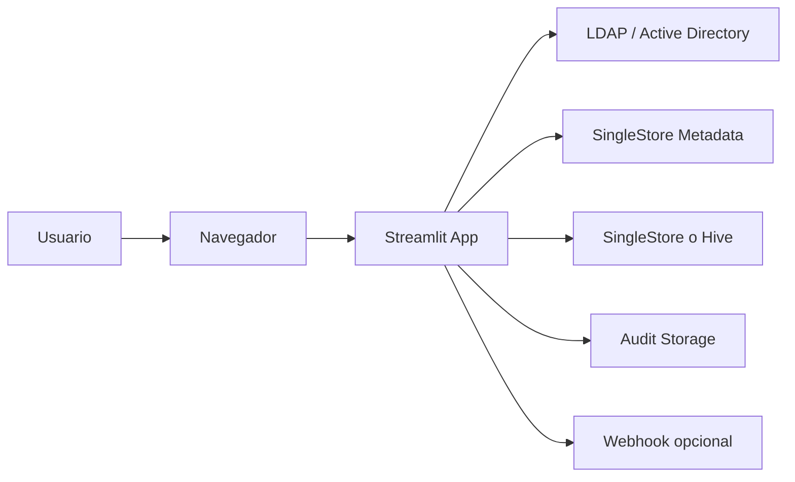
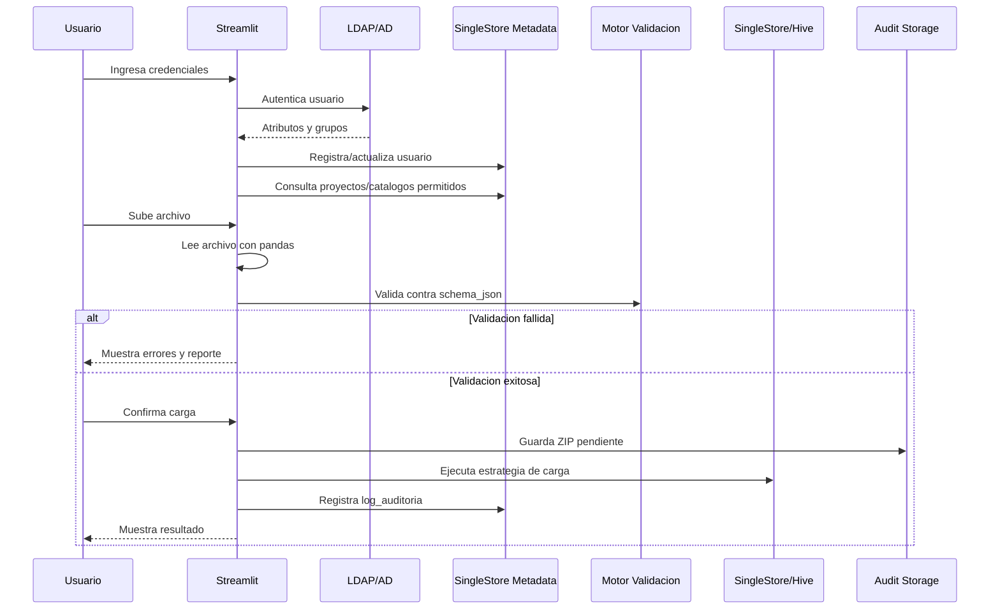

# Data Gatekeeper

## Manual tecnico del sistema

Este documento describe como esta construido Data Gatekeeper, como se configura,
como fluye una carga de catalogo y que debe revisar un desarrollador, soporte o
infraestructura para mantener el sistema.

El README principal esta orientado a usuarios funcionales. Este archivo esta
orientado a personas que necesitan entender, operar, desplegar o modificar la
aplicacion.

## 1. Objetivo tecnico

Data Gatekeeper es una aplicacion web interna para cargar catalogos manuales de
forma controlada. El sistema lee archivos, valida estructura y reglas de calidad
en memoria, y solo despues de una validacion exitosa escribe los datos en el
destino configurado.

El sistema busca cubrir estos puntos:

- centralizar cargas manuales de catalogos;
- evitar cargas directas sin validacion;
- validar columnas, tipos, nulabilidad y reglas de negocio;
- controlar permisos por usuario o rol;
- registrar auditoria de cargas exitosas y fallidas;
- conservar evidencia del archivo original cargado;
- permitir administracion funcional de catalogos desde el portal.

## 2. Arquitectura general

La aplicacion usa una arquitectura Python/Streamlit. La interfaz y la
orquestacion corren en el mismo proceso, mientras que la logica de autenticacion,
validacion, lectura de archivos, administracion, carga y auditoria esta separada
en modulos.



Componentes principales:

- `Streamlit`: interfaz web y flujo de sesion.
- `LDAP / Active Directory`: autenticacion de usuarios.
- `pandas`: lectura y manejo de archivos en memoria.
- `dg_validators`: motor de validacion.
- `SingleStore`: metadata, auditoria y destino de datos.
- `Hive`: destino opcional de datos.
- `Audit Storage`: almacenamiento ZIP del archivo original.
- `Docker / Nginx`: despliegue y proxy inverso.

## 3. Estructura del proyecto

```text
data_gatekeeper/
  app.py
  auth/
  config/
  dg_validators/
  storage/
  reports/
  services/
  views/
  utils/
  scripts/
  docker/
  deploy/
  docs/
  tests/
  assets/
```

Responsabilidad por carpeta:

- `app.py`: punto de entrada Streamlit.
- `auth/`: autenticacion LDAP/AD.
- `config/`: settings y lectura de catalogos desde metadata.
- `dg_validators/`: motor de validacion de DataFrames.
- `storage/`: lectura de CSV, TXT y Excel.
- `reports/`: generacion del reporte Excel de errores.
- `services/`: integracion con bases, auditoria, usuarios y notificaciones.
- `views/`: pantallas Streamlit.
- `utils/`: logging y mensajes seguros para usuario.
- `scripts/`: healthchecks y utilitarios operativos.
- `docker/`: Dockerfile, compose, Nginx e inicializacion de base.
- `deploy/`: ejemplo de variables para produccion.
- `docs/`: documentacion.
- `tests/`: pruebas automatizadas.
- `assets/`: imagenes usadas por README y UI.

## 4. Flujo de ejecucion



Pasos principales:

1. `app.py` inicializa logging, pagina y estado de sesion.
2. Si el usuario no esta autenticado, se muestra `views/login_view.py`.
3. El login llama a `auth/ldap_auth.py`.
4. El usuario se registra o actualiza en `usuarios`.
5. Se cargan proyectos y catalogos activos desde `catalogos_config`.
6. La UI filtra catalogos por permisos.
7. El usuario sube archivo y `storage/file_handler.py` lo lee.
8. `dg_validators/engine.py` valida estructura y contenido.
9. Si falla, se muestra detalle y se puede descargar reporte.
10. Si pasa, `services/db_writer.py` ejecuta carga y auditoria.
11. El historial se consulta desde `log_auditoria`.

## 5. Entrada de aplicacion

Archivo principal:

- `app.py`

Responsabilidades:

- configurar Streamlit;
- inicializar `st.session_state`;
- configurar logging;
- decidir vista actual;
- enrutar a login, portal principal, administracion o historial.

Estado de sesion relevante:

- `authenticated`
- `user_info`
- `current_view`
- `selected_project_id`
- `selected_catalog`
- `uploaded_df`
- `validation_result`
- `current_step`
- `carga_ejecutada`

## 6. Autenticacion LDAP/AD

Archivo principal:

- `auth/ldap_auth.py`

El sistema soporta dos formas de prueba/autenticacion:

- `LDAPSEARCH`
- `LDAP3_SIMPLE`

El modo se selecciona con:

```env
LDAP_AUTH_METHOD=LDAPSEARCH
```

o:

```env
LDAP_AUTH_METHOD=LDAP3_SIMPLE
```

### 6.1 Modo LDAPSEARCH

Este modo ejecuta el binario del sistema `ldapsearch` mediante `subprocess`.

Equivale al comando:

```powershell
ldapsearch -x -H "ldap://austro.grpfin:389" -D "usuario@austro.grpfin" -w "password" -b "DC=austro,DC=grpfin" "(sAMAccountName=usuario)" cn mail memberOf
```

Variables usadas:

```env
LDAP_AUTH_METHOD=LDAPSEARCH
LDAP_SERVER=ldap://austro.grpfin:389
LDAP_DOMAIN=austro.grpfin
LDAP_BASE_DN=DC=austro,DC=grpfin
LDAP_SEARCH_ATTRIBUTE=sAMAccountName
LDAPSEARCH_BIN=ldapsearch
LDAP_BIND_TEMPLATE={username}@{domain}
LDAP_SEARCH_BIND_DN=
LDAP_SEARCH_BIND_PASSWORD=
LDAP_REQUIRED_GROUP=
```

Consideraciones:

- requiere que `ldapsearch` exista en el sistema operativo o contenedor;
- en Windows puede requerir instalar OpenLDAP o definir una ruta completa en
  `LDAPSEARCH_BIN`;
- si no existe el binario, el login falla antes de llegar al servidor LDAP;
- si el servidor responde `invalidCredentials`, el problema ya es usuario,
  password o formato de bind.

### 6.2 Modo LDAP3_SIMPLE

Este modo usa la libreria Python `ldap3`. Es util cuando no existe el binario
`ldapsearch` en la maquina local.

Variables usadas:

```env
LDAP_AUTH_METHOD=LDAP3_SIMPLE
LDAP_SERVER=ldap://austro.grpfin:389
LDAP_PORT=389
LDAP_DOMAIN=austro.grpfin
LDAP_USE_SSL=false
LDAP_BASE_DN=DC=austro,DC=grpfin
LDAP_SEARCH_ATTRIBUTE=sAMAccountName
LDAP_BIND_TEMPLATE={username}@{domain}
LDAP_REQUIRED_GROUP=
```

Consideraciones:

- `ldap3` hace simple bind con el usuario final;
- el usuario de bind se construye con `LDAP_BIND_TEMPLATE`;
- el host se obtiene desde `LDAP_SERVER`, pero `LDAP_PORT` tambien debe estar
  definido;
- `LDAP_USE_SSL=true` debe usarse solo si el servidor LDAP expone LDAPS;
- `LDAP_REQUIRED_GROUP` permite exigir pertenencia a un grupo.

### 6.3 Grupos y roles

El sistema busca el atributo `memberOf`.

Reglas actuales:

- si `memberOf` contiene `GATEKEEPER_ADMIN`, el rol resuelto es `Admin`;
- si no contiene ese grupo, el rol por defecto es `Publicador`;
- si `LDAP_REQUIRED_GROUP` tiene valor, el usuario debe pertenecer a ese grupo
  para poder entrar.

Para el caso de grupos como `Usuarios_Hadoop`, se puede usar:

```env
LDAP_REQUIRED_GROUP=Usuarios_Hadoop
```

Si el usuario autentica pero no tiene el grupo requerido, el sistema rechaza el
login.

### 6.4 Preguntas necesarias para AD

Antes de cerrar una configuracion LDAP real, confirmar:

- servidor LDAP o DNS correcto;
- puerto correcto, normalmente `389` o `636`;
- si se usa SSL/LDAPS;
- formato de login aceptado: `usuario@dominio`, `DOMINIO\usuario` o DN;
- `Base DN` correcto;
- atributo de busqueda correcto, normalmente `sAMAccountName`;
- grupo requerido para acceder;
- si el atributo `memberOf` esta disponible para el usuario.

## 7. Configuracion

Archivo principal:

- `.env`

Archivo de referencia:

- `.env.example`

La configuracion se carga en:

- `config/settings.py`

Bloques principales:

- `APP`: ambiente, puerto y logs;
- `ADMIN LOCAL`: usuario de emergencia;
- `SINGLESTORE`: conexion a metadata y destino;
- `HIVE`: habilitacion y conexion a Hive;
- `LDAP`: autenticacion y grupos;
- `METADATA`: nombres de tablas;
- `AUDITORIA`: ruta y permisos de evidencia;
- `LIMITES`: tamano y filas maximas;
- `ALERTAS`: webhook operativo.

Variables sensibles:

- `SS_PASSWORD`
- `SYSTEM_ADMIN_PASSWORD`
- passwords LDAP si se usan cuentas tecnicas;
- `ALERT_WEBHOOK_URL` si contiene token.

No se deben versionar valores reales en repositorios compartidos.

## 8. Metadata administrativa

La base administrativa esperada es:

```text
gatekeeper_meta
```

El script inicial vive en:

- `docker/init_db/01_init.sql`

Tablas principales:

- `proyectos`
- `catalogos_config`
- `usuarios`
- `permisos_catalogo`
- `log_auditoria`

### 8.1 proyectos

Agrupa catalogos por dominio funcional.

Campos:

- `project_id`
- `nombre`
- `descripcion`
- `activo`

### 8.2 catalogos_config

Define catalogos cargables, destino y reglas.

Campos:

- `catalog_id`
- `project_id`
- `nombre`
- `descripcion`
- `base_datos`
- `tabla_destino`
- `destino`
- `estrategia`
- `schema_json`
- `activo`

### 8.3 usuarios

Mantiene informacion interna del portal.

Campos:

- `username`
- `nombre`
- `email`
- `rol`
- `activo`
- `ultimo_acceso`

### 8.4 permisos_catalogo

Permite limitar catalogos por usuario o rol.

Campos:

- `catalog_id`
- `tipo`
- `valor`

Ejemplos:

```text
tipo=rol, valor=Publicador
tipo=usuario, valor=jberrezueta
```

### 8.5 log_auditoria

Registra cada intento de carga.

Campos:

- `operation_id`
- `timestamp_carga`
- `usuario_ad`
- `project_id`
- `id_catalogo`
- `nombre_archivo_original`
- `filas_procesadas`
- `estrategia_usada`
- `destino`
- `estado_carga`
- `errores_json`
- `ruta_zip_auditoria`

## 9. Catalogos y permisos

La lectura de proyectos y catalogos para el usuario ocurre en:

- `config/catalogs.py`

Funciones principales:

- `get_proyectos_list()`
- `get_catalogs_by_project(project_id, username, rol)`
- `get_catalog_by_id(project_id, catalog_id)`

Reglas de visibilidad:

- un `Admin` ve todos los catalogos activos del proyecto;
- un catalogo sin permisos configurados queda visible para todos;
- si hay permisos, se valida por `rol` o por `usuario`;
- los catalogos inactivos no aparecen.

La administracion funcional vive en:

- `views/admin_catalogs_view.py`
- `services/db_admin.py`

Capacidades del admin:

- descubrir bases y tablas;
- registrar catalogos;
- generar `schema_json` desde una tabla;
- configurar reglas;
- editar catalogos;
- desactivar catalogos;
- asignar permisos;
- administrar usuarios;
- exportar e importar respaldos funcionales.

## 10. Lectura de archivos

Archivo:

- `storage/file_handler.py`

Formatos soportados:

- `.csv`
- `.txt`
- `.xlsx`
- `.xls`

Funciones principales:

- `read_uploaded_file()`
- `detect_file_delimiter()`
- `get_excel_sheets()`
- `get_file_stats()`

Comportamiento:

- los CSV/TXT se leen con `pandas.read_csv`;
- se intenta detectar delimitador si el separador no fue ajustado;
- Excel se lee con `pandas.read_excel`;
- las columnas se normalizan quitando espacios al inicio y final;
- los errores de lectura se traducen a mensajes entendibles para la UI.

## 11. Motor de validacion

Archivo:

- `dg_validators/engine.py`

Funcion principal:

- `validate_dataframe(df, schema_config)`

Estructuras:

- `ValidationError`
- `ValidationResult`

Tipos soportados:

- `str`
- `int`
- `float`
- `bool`

Validaciones estructurales:

- columnas faltantes;
- columnas extras;
- archivo vacio.

Validaciones por dato:

- tipo de dato;
- no nulo;
- dominio;
- minimo;
- maximo;
- longitud minima;
- longitud entre minimo y maximo;
- expresion regular.

Reglas JSON soportadas:

```json
{"tipo": "isin", "valor": ["A", "I"]}
{"tipo": "gte", "valor": 0}
{"tipo": "lte", "valor": 100}
{"tipo": "min_length", "valor": 3}
{"tipo": "str_length", "min": 5, "max": 10}
{"tipo": "regex", "valor": "^[A-Z]{3}-\\d{3}$"}
```

Si la validacion falla, no se ejecuta escritura a base.

## 12. Reporte de errores

Archivo:

- `reports/report_builder.py`

Funcion:

- `build_error_report()`

Salida:

- archivo Excel en memoria;
- hoja de resumen;
- hoja de detalle;
- conteo por tipo de error;
- colores por categoria.

El reporte se ofrece al usuario desde la vista principal cuando la validacion
falla.

## 13. Carga a destino

Archivo:

- `services/db_writer.py`

Funcion principal:

- `execute_load()`

Responsabilidades:

- preparar `operation_id`;
- guardar ZIP auditado inicial;
- escribir en SingleStore o Hive;
- renombrar evidencia a `exito` o `fallo`;
- registrar `log_auditoria`;
- enviar alerta si corresponde.

### 13.1 SingleStore

Estrategias:

- `append`: inserta filas nuevas;
- `overwrite`: `TRUNCATE TABLE` + `INSERT` dentro de transaccion.

La estrategia `reproceso` existe como logica interna heredada, pero no se
publica en la interfaz de administracion.

### 13.2 Hive

Hive se controla con:

```env
HIVE_ENABLED=true
```

Si esta en `false`, el sistema bloquea operaciones Hive.

Estrategias:

- `append`: `INSERT INTO`;
- `overwrite`: `INSERT OVERWRITE`.

Consideracion local:

En Windows, dependencias como `sasl` pueden fallar al instalarse por falta de
headers nativos. Para desarrollo local sin Hive, usar:

```env
HIVE_ENABLED=false
```

## 14. Auditoria

La auditoria tiene dos partes:

- registro en `log_auditoria`;
- ZIP del archivo original en `AUDIT_STORAGE_PATH`.

El ZIP incluye:

- archivo original;
- `audit_manifest.json`;
- hash SHA-256;
- usuario;
- catalogo;
- `operation_id`;
- fecha de creacion.

Patron de ruta:

```text
{AUDIT_STORAGE_PATH}/{catalog_id}/{YYYYMMDD}/{timestamp}_{estado}_{usuario}_{operation_id}_{archivo}.zip
```

Estados:

- `pendiente`;
- `exito`;
- `fallo`.

El archivo se intenta dejar en modo solo lectura si:

```env
AUDIT_STORAGE_READONLY_AFTER_WRITE=true
```

## 15. Historial

Vista:

- `views/history_view.py`

Fuente:

- `services/db_writer.get_audit_log()`

Comportamiento:

- los admins pueden consultar todas las cargas;
- los publicadores consultan sus propias cargas;
- se filtra por fecha, estado y usuario;
- se muestran metricas y tendencias;
- se puede exportar CSV.

## 16. Notificaciones

Archivo:

- `services/notifier.py`

Variables:

```env
ALERTS_ENABLED=false
ALERT_WEBHOOK_URL=
ALERT_ON_SUCCESS=false
```

Eventos:

- `load_failed`
- `load_succeeded`

Por defecto solo conviene alertar fallos.

## 17. Docker y despliegue

Archivos:

- `docker/Dockerfile`
- `docker/docker-compose.yml`
- `docker/docker-compose.local-sim-real.yml`
- `docker/nginx.conf`
- `docker/init_db/00_create_db.sql`
- `docker/init_db/01_init.sql`

Escenarios:

- local Windows con Streamlit directo;
- local o laboratorio con Docker;
- servidor con app + Nginx y servicios externos;
- simulacion con LDAP/OpenLDAP o servicios de prueba.

Comando base productivo:

```bash
docker compose -f docker/docker-compose.yml up -d --build
```

Comando local de simulacion, segun compose disponible:

```bash
docker compose -f docker/docker-compose.local-sim-real.yml up -d --build
```

Inicializacion de metadata:

```bash
docker exec -i gatekeeper_singlestore singlestore -uroot -p<PASSWORD> < docker/init_db/00_create_db.sql
docker exec -i gatekeeper_singlestore singlestore -uroot -p<PASSWORD> gatekeeper_meta < docker/init_db/01_init.sql
```

## 18. Healthchecks

Archivo:

- `scripts/healthcheck.py`

Modos:

- `liveness`
- `readiness`

Valida:

- health HTTP de Streamlit;
- conectividad a SingleStore;
- conectividad a LDAP;
- conectividad a Hive solo si `HIVE_ENABLED=true`.

Uso:

```bash
python scripts/healthcheck.py --mode liveness
python scripts/healthcheck.py --mode readiness
```

## 19. Pruebas

Carpeta:

- `tests/`

Pruebas actuales:

- `test_engine.py`: motor de validacion;
- `test_file_handler.py`: lectura de archivos;
- `test_db_admin_filters.py`: filtro de bases visibles;
- `test_ldap_auth.py`: parsing y autenticacion simulada por `ldapsearch`.

Comando:

```bash
pytest
```

Si se ejecuta en Windows y Hive no es necesario, conviene mantener
`HIVE_ENABLED=false` para desarrollo local.

## 20. Operacion local

Activar entorno:

```powershell
Set-ExecutionPolicy -Scope Process -ExecutionPolicy RemoteSigned
.\venv\Scripts\Activate.ps1
```

Instalar dependencias:

```powershell
python -m pip install -r requirements.txt
```

Levantar app:

```powershell
streamlit run app.py
```

Abrir:

```text
http://localhost:8501
```

## 21. Troubleshooting

### Login falla por `ldapsearch` no encontrado

Sintoma:

```text
No se encontro el binario ldapsearch
```

Causa:

- `ldapsearch` no esta instalado;
- `LDAPSEARCH_BIN` no apunta a una ruta valida.

Soluciones:

- instalar cliente OpenLDAP;
- usar ruta completa en `LDAPSEARCH_BIN`;
- cambiar a `LDAP_AUTH_METHOD=LDAP3_SIMPLE`.

### Login falla por `invalidCredentials`

Sintoma:

```text
LDAPBindError: invalidCredentials
```

Causa probable:

- password incorrecto;
- formato de bind incorrecto;
- dominio incorrecto;
- usuario no autorizado para ese flujo.

Validar:

- `LDAP_BIND_TEMPLATE`;
- `LDAP_DOMAIN`;
- formato esperado por AD;
- si el usuario pertenece al grupo requerido.

### Usuario autentica pero no entra

Validar:

- `LDAP_REQUIRED_GROUP`;
- atributo `memberOf`;
- nombre exacto del grupo;
- rol guardado en tabla `usuarios`;
- si el usuario esta inactivo.

### No aparecen catalogos

Validar:

- catalogos activos en `catalogos_config`;
- permisos en `permisos_catalogo`;
- rol del usuario;
- proyecto activo;
- si `HIVE_ENABLED=false` y el catalogo era Hive.

### Falla instalacion de dependencias Hive en Windows

Sintoma comun:

```text
fatal error C1083: No se puede abrir sasl/sasl.h
```

Causa:

- falta dependencia nativa SASL en Windows.

Opciones:

- desarrollar sin Hive localmente;
- usar Docker/Linux para Hive;
- instalar dependencias nativas necesarias.

## 22. Reglas de mantenimiento

Recomendaciones:

- mantener validaciones nuevas dentro de `dg_validators/engine.py`;
- no escribir a destino antes de validar;
- no mostrar errores tecnicos crudos al usuario;
- registrar auditoria tanto en exito como en fallo;
- no mezclar logica de UI con SQL complejo;
- no versionar credenciales reales;
- actualizar `.env.example` cuando se agreguen variables nuevas;
- agregar pruebas cuando cambien contratos de validacion o autenticacion.

## 23. Limitaciones actuales

El sistema actualmente no implementa de forma nativa:

- unicidad entre filas;
- validaciones cruzadas entre columnas;
- validacion contra tablas externas;
- reglas SQL personalizadas por catalogo;
- API HTTP separada;
- descarga controlada de ZIP auditado desde UI;
- versionado historico de `schema_json`.

## 24. Puntos de extension

Mejoras naturales:

- separar backend API si se requiere integracion externa;
- ampliar reglas de validacion;
- agregar versionado de catalogos;
- agregar pruebas de carga a destino con mocks;
- formalizar observabilidad y metricas;
- mejorar soporte Windows para pruebas LDAP;
- agregar manual especifico de operacion para administradores.

## 25. Checklist tecnico antes de produccion

- `.env` productivo fuera del repositorio.
- `SYSTEM_ADMIN_PASSWORD` fuerte o deshabilitado segun politica.
- `SS_HOST`, `SS_PORT`, `SS_USER`, `SS_PASSWORD` validados.
- Metadata inicial creada en `gatekeeper_meta`.
- `LDAP_AUTH_METHOD` definido y probado.
- Grupo requerido definido si aplica.
- `HIVE_ENABLED` definido segun alcance real.
- Ruta `AUDIT_STORAGE_PATH` con permisos correctos.
- Nginx publicado y healthcheck activo.
- Pruebas automatizadas ejecutadas.
- Primer catalogo validado con archivo correcto y archivo erroneo.

## 26. Resumen

Data Gatekeeper es un portal interno de ingesta controlada. Su valor tecnico
esta en separar configuracion, permisos, validacion, carga y auditoria para que
los usuarios puedan publicar catalogos sin impactar tablas finales con archivos
invalidos.

Las piezas criticas para mantenerlo estable son:

- autenticacion LDAP;
- metadata `gatekeeper_meta`;
- `schema_json` por catalogo;
- motor `dg_validators`;
- `services/db_writer.py`;
- `log_auditoria`;
- almacenamiento auditado.
